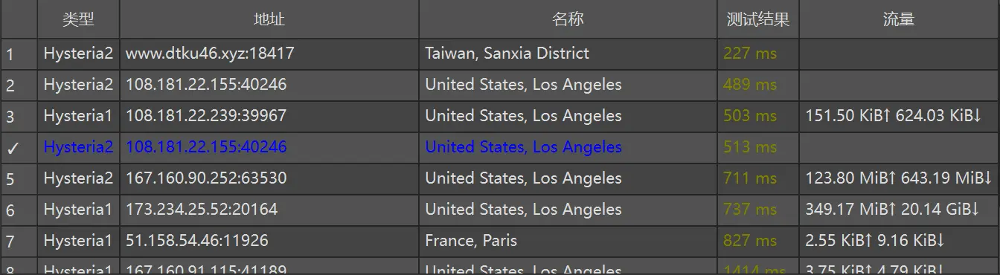

[感谢大佬Alvin🥳🥳🥳](https://github.com/Alvin9999)

Chromego项目地址：https://github.com/Alvin9999/new-pac Star一下吧！



大概就是这样的，显示节点地理位置，尽量别滥用，谢谢

项目只是提取大佬项目中的节点，没有技术含量（节点不是项目中的全部，我只提取了经常更新维护的部分）

Windows: https://github.com/MatsuriDayo/nekoray/releases

Andriod: https://github.com/MatsuriDayo/NekoBoxForAndroid/releases

> 订阅链接

```
https://raw.githubusercontent.com/markbang/chromegopacs/main/hy2pac.txt
```

PS:没有滥用action资源，6小时运行一次🤐
